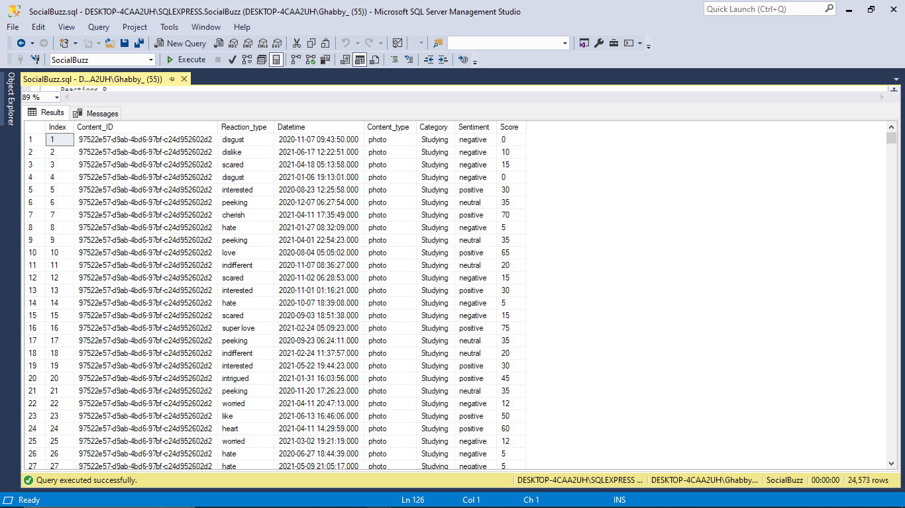

# Analyzing-the-Buzz-A-Data-Driven-Exploration-for-User-Engagement-and-Growth-on-Social-Buzz-Platform

## Introduction
Accenture, a company specializing in IT services and consulting, engaged with Social Buzz, a prominent social media conglomerate. I assumed the role of a data analyst as part of an internship program facilitated through a job simulation platform. This documentation outlines the procedural aspects and my involvement in the client project.


## Project Overview
With Social Buzz experiencing rapid growth and its core product being inherently digital, the volume of data generated, collected, and requiring analysis had become immense. Daily, the platform generates over 100,000 pieces of content, accumulating to 36,500,000 posts annually. 

However, the challenge lies in managing this vast amount of unstructured data, making it difficult to derive meaningful insights and prompting the question of how to effectively capitalize on such a substantial dataset.

The Objective was clear: to showcase expertise by harnessing the vast data available, model it into a dataset that can precisely answer the business questions and offer actionable insights, aiding Social Buzz's growth. 

We strategically identified the top 5 content categories,with the aim of understanding user engagement patterns, and optimizing strategies to foster Social Buzz’s expansion aligning with growth goals and an impending IPO.


## Dataset Collection and Preparation
I received seven sample datasets in CSV format: User, Profile, Location, Session, Content, Reaction, and Reaction Type. 

My task involved carefully choosing datasets crucial for analyzing the Top 5 content categories. 

  
Prioritizing datasets that provide valuable insights into user interactions, reaction types across categories, and scores assigned to each type of reaction, the selected datasets included Content, Reaction, and Reaction Types. 

These datasets were subsequently merged into a unified dataset. Utilizing aggregate score calculations, the popularity of each content category was then determined.

  
> Preview of the ‘Reactions Types’ Table


> Preview of the ‘Content’ Table


> Preview of the ‘Reactions’ Table

## Next, a quick overview of the cleaning process


Steps taken here
* Starting with the ‘ReactionTypes’ table I had to rename the column to remove the spaces between the column names
* I did the same for the ‘Reactions’ table, I then went ahead to drop the irrelevant column User_ID as it wasn’t needed in this analysis


Next I checked for rows with null or empty values and dropped them using this SQL syntax
```
-- Checking for null values

SELECT *
FROM Reactions
WHERE Reaction_type = '' OR Reaction_type IS NULL;

-- Dropping Null Values
DELETE FROM Reactions
WHERE Reaction_type = '' OR Reaction_type IS NULL;
```

* I did the same for duplicate rows using a CTE function
```
WITH RDuplicateCTE AS (
    SELECT 
        Content_ID, Reaction_type, Datetime, [Index],
        ROW_NUMBER() OVER (PARTITION BY Content_ID, Reaction_type, Datetime, [Index]
		ORDER BY (SELECT NULL)) AS RowNum
    FROM Reactions
)
DELETE FROM RDuplicateCTE WHERE RowNum > 1;
```


* I repeated the process for the ‘Content; table


* I then proceeded to join the tables as one using the SQL JOIN function
```
-- JOINING ALL TABLES TOGETHER --

SELECT
    R.*,
    C.Content_type, C.Category, 
    RT.Sentiment, RT.Score
FROM
    Reactions R
JOIN
    Content C ON R.Content_ID = C.Content_ID
JOIN
    ReactionTypes RT ON R.Reaction_type = RT.Reaction_type;


	SELECT
    R.*,
    C.Content_type, C.Category, 
    RT.Sentiment, RT.Score
INTO SB_Merged
FROM
    Reactions R
JOIN
    Content C ON R.Content_ID = C.Content_ID
JOIN
    ReactionTypes RT ON R.Reaction_type = RT.Reaction_type;
```


After successfully joining the tables I noticed some data points in the category Column where entered with a quotation mark (“) which would raise issues if not addressed 

Using this SQL I sorted that 
```
	-- Replace values in Category that have (") with () 
UPDATE SB_Merged
SET Category = REPLACE(Category, '"', '');
``


> Preview of the merged sample dataset

### Presenting the Top 5 Categories


Using this SQL Syntax
```
SELECT TOP 5
    Category,
    SUM(Score) AS TotalScore  
FROM
    SB_Merged  
GROUP BY
    Category
ORDER BY
    TotalScore DESC;
  ```
## Insights and Data Findings
* The analysis unveiled the top 5 content categories, each with its unique engagement score. Animals, Food, Healthy Eating, Science, and Technology emerged as the top 5 content categories by popularity, offering valuable insights into user preferences and content trends.


> Chart showing the TOP 5 Categories by Popularity

* Beyond the top 5, I explored the number of unique categories (which amounts to a total of 16), the most used reaction type across all content categories- ‘adore’ , and the month with the most posts- January.


* Furthermore, a noticeable dip in posts in the months of June (both in 2020 and 2021) raised an important point about potential low user retention.

**Note**: To delve deeper into the causes behind this trend, I proposed acquiring a dataset with features such as user activity, new feature releases, or external events that may have brought about the dip in post count during June. This additional data will be essential for a more nuanced analysis


> Image showing other relevant insights


> Chart showing the total distinct categories ranking by their popularity 


## Actionable Insights

Overall, what's particularly interesting is the dominance of dietary trends in user engagement. Food-themed categories, combined, namely ‘Healthy Eating’ and ‘Food’, drive the highest engagement,suggesting a strong audience affinity for dietary content. 

Hence presenting an opportunity for strategic campaigns with brands aligned with these themes to boost user engagement and retention.

## Next Steps
Moving forward,  my proposed next steps included 
1. launching strategic content campaigns to leverage dietary trends and 
2. Investigating the drop in post counts during June by acquiring datasets with relevant features. 

These initiatives aim to enhance user engagement, user retention, and overall platform activity


## Conclusion
In conclusion, this analysis has provided actionable insights that can shape the future of Social Buzz. I encourage collaboration and implementation of these strategies to optimize user engagement and contribute to the platform's success

